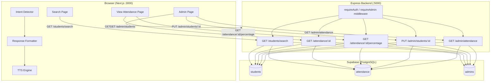

# Design Document — Voice Attendance Completion

## Overview

This design covers the completion of the Voice Attendance System by implementing three categories of work in tandem:

1. **Five new Express backend routes** — student search, per-student attendance history, attendance percentage, admin student-edit, and admin attendance log retrieval.
2. **Frontend page wiring** — the Search, View Attendance, and Admin pages are promoted from static skeletons to fully live React components backed by real API calls and local state.
3. **AI Assistant / Conversational layer** — a pure-client-side module that classifies utterance intent, formats template-based natural language responses, and speaks them using the browser's `window.speechSynthesis` API.

All three areas share the existing infrastructure: the Node.js/Express backend on port 5000, the Next.js frontend on port 3000, the Python/FastAPI voice microservice on port 8000, and a Supabase PostgreSQL database. No new infrastructure is introduced.

---

## Architecture

The system follows an existing three-tier + microservice architecture. This feature adds within that existing structure:



### Key architectural constraints preserved

- The `voice_embedding` column is **never** sent to any client — the backend always strips it before responding.
- Role separation is enforced in middleware (`requireAuth` → `requireAdmin`). Student-scoped routes additionally compare `student_id` in the URL against the linked student record for the authenticated user.
- The AI assistant layer runs entirely in the browser — no LLM API call, no new backend endpoint for intent or formatting.

---

## Components and Interfaces

### Backend: New Express Routes

All new routes are added inside `backend/src/index.js` following the existing middleware pattern.

#### `GET /students/search`
- **Middleware**: `requireAuth`
- **Query params**: `q` (string, 1–100 chars after trim)
- **Logic**: Supabase `ilike` filter on `name` and `roll_number` columns; computes `attendance_percentage` via a correlated count; strips `voice_embedding`; returns at most 50 results.
- **Response** (200): `{ status: 'ok', students: Student[] }`
- **Errors**: 400 (missing/empty q), 401 (auth), 500 (db)

#### `GET /attendance/:student_id`
- **Middleware**: `requireAuth`
- **Auth rule**: If `req.user.role === 'student'`, must look up the student row with `auth_user_id = req.user.id` and confirm it matches `student_id`.
- **Response** (200): `{ status: 'ok', records: AttendanceRecord[] }` ordered date descending.
- **Errors**: 401, 403, 404 (student not found), 500

#### `GET /attendance/:student_id/percentage`
- **Middleware**: `requireAuth`
- **Auth rule**: Same student-ownership check as above.
- **Response** (200): `{ status: 'ok', student_id, percentage, present_count, total_count }`
- **Errors**: 401, 403, 404, 500

#### `PUT /admin/students/:id`
- **Middleware**: `requireAuth`, `requireAdmin`
- **Body**: `{ name?, roll_number?, department? }` (at least one non-empty field)
- **Logic**: Validates field constraints; checks roll_number uniqueness (excluding current student); updates only provided fields.
- **Response** (200): `{ status: 'ok', student: UpdatedStudent }` (no `voice_embedding`)
- **Errors**: 400 (empty body / bad values), 401, 403, 404, 409 (duplicate roll_number), 500

#### `GET /admin/attendance`
- **Middleware**: `requireAuth`, `requireAdmin`
- **Query params**: `student_id?` (UUID), `date?` (YYYY-MM-DD)
- **Logic**: Joins `attendance` with `students` for name/roll_number; applies optional filters; returns up to 1000 records ordered date desc, time desc.
- **Response** (200): `{ status: 'ok', records: AdminAttendanceRecord[] }`
- **Errors**: 400 (bad UUID or date format), 401, 403, 500

---

### Frontend: Page Components

#### `SearchPage` (`app/search/page.js`)
Promoted to a `"use client"` component.

| State variable | Type | Purpose |
|---|---|---|
| `query` | `string` | Controlled input value |
| `results` | `Student[] \| null` | null = initial, [] = no results |
| `loading` | `boolean` | In-flight indicator |
| `error` | `string \| null` | Error message |
| `abortRef` | `React.useRef<AbortController>` | Cancel in-flight request on new submit |

Key behaviors:
- Form submit fires `GET /students/search?q={query}` with `Authorization: Bearer <token>` from `useAuth()`.
- Clears `results` and `error` on new submit; cancels previous request via `AbortController`.
- Displays loading spinner, result cards (name + roll + percentage), "No students found", or error message as appropriate.
- Clearing the input resets to initial state.

#### `ViewAttendancePage` (`app/view-attendance/page.js`)
Promoted to `"use client"`.

| State variable | Type | Purpose |
|---|---|---|
| `records` | `AttendanceRecord[] \| null` | null = loading |
| `percentage` | `number \| null` | null = loading |
| `loadingRecords` | `boolean` | |
| `loadingPct` | `boolean` | |
| `error` | `string \| null` | |
| `studentId` | `string \| null` | Resolved from `/auth/me` or a separate students lookup |

On mount: if authenticated, fetch student profile from `GET /students/me-profile` (or look up student by auth user via the search endpoint), then fire both `GET /attendance/:student_id` and `GET /attendance/:student_id/percentage` in parallel with `Promise.all`.

> **Note**: The backend currently does not expose a `/students/me-profile` endpoint. The design resolves this by adding a lightweight `GET /students/me` route (or by storing `student_id` in the auth context after enrollment). The preferred approach here is to store `student_id` in `localStorage` during enrollment and read it on this page, falling back to displaying the "complete enrollment" message if not present.

Status badge: `present` → green badge; `absent` → red badge.

#### `AdminPage` (`app/admin/page.js`)
Already a `"use client"` component.

Extended with:
- `students` state: loaded from `GET /admin/students` on mount (already wired for the existing endpoint).
- `editingId` + `editForm` state: drives inline edit row.
- `logsVisible` state: toggled by clicking the "Attendance Logs" action card.
- `logs` / `logsFilters` state: drives the logs table.

Inline edit form validation:
- `name`: 1–100 chars (non-empty required)
- `roll_number`: 1–50 chars (non-empty required)
- `department`: 0–100 chars (optional/empty allowed)

---

### AI Assistant Layer (Client-Side)

Two pure utility modules, added under `frontend/app/lib/`:

#### `intentDetector.js`

```
detectIntent(utterance: string): 'mark_attendance' | 'check_attendance' | 'search_student' | 'unknown'
```

Evaluation order (first match wins):
1. `/\bpresent\b/i` → `mark_attendance`
2. `/\b(percentage|attendance|how many classes|attended)\b/i` → `check_attendance`
3. `/\b(search|find)\b/i` → `search_student`
4. Fallback → `unknown`

Returns `unknown` for empty strings or strings matching no pattern.

#### `responseFormatter.js`

```
formatResponse(
  intent: string,
  data: object | null,
  query?: string
): string
```

| Intent | Data requirements | Output template |
|---|---|---|
| `check_attendance` | `data.percentage` | `"Your attendance is {percentage}%."` |
| `search_student` (found) | `data.name`, `data.roll_number`, `data.percentage` | `"{name}, Roll No. {roll_number}, Attendance: {percentage}%."` |
| `search_student` (not found) | `data` is null or `data.found === false` | `"No student found matching '{query}'."` (query truncated to 100 chars) |
| `mark_attendance` (new) | `data.name`, `data.already_marked = false` | `"Attendance marked successfully for {name}."` |
| `mark_attendance` (already) | `data.name`, `data.already_marked = true` | `"You are already marked present today, {name}."` |
| `unknown` | any | `"I didn't understand that. You can say 'present' to mark attendance, ask for your 'percentage', or 'search' for a student."` |
| unknown intent string | any | `unknown` fallback (same as above) |
| data-dependent intent with null/missing data | null / incomplete | `"Sorry, I couldn't retrieve the data needed to complete your request."` |

#### `ttsEngine.js`

```
speak(text: string): void
stopSpeaking(): void
isSpeaking(): boolean
```

- Truncates `text` to 5000 characters before speaking.
- Calls `window.speechSynthesis.cancel()` before every `speak()` call.
- Sets `utterance.lang = 'en-US'`.
- No-ops gracefully if `window.speechSynthesis` is unavailable.
- Fires callbacks (`onStart`, `onEnd`, `onError`) for the frontend to update speaking indicator state.

---

## Data Models

### `Student` (search response shape)

```typescript
interface Student {
  id: string;           // UUID
  name: string;
  roll_number: string;
  department: string | null;
  attendance_percentage: number; // integer 0–100
}
```

### `AttendanceRecord` (history endpoint shape)

```typescript
interface AttendanceRecord {
  id: string;           // UUID
  date: string;         // YYYY-MM-DD
  time: string;         // ISO 8601 timestamp
  status: 'present' | 'absent';
  verification_score: number | null;
}
```

### `AttendancePercentage` (percentage endpoint shape)

```typescript
interface AttendancePercentage {
  student_id: string;
  percentage: number;   // integer 0–100, floor(present/total*100)
  present_count: number;
  total_count: number;
}
```

### `AdminAttendanceRecord` (admin logs endpoint shape)

```typescript
interface AdminAttendanceRecord {
  id: string;
  student_id: string;
  student_name: string;
  roll_number: string;
  date: string;         // YYYY-MM-DD
  time: string;         // ISO 8601 timestamp
  status: 'present' | 'absent';
  verification_score: number | null;
}
```

### `UpdatedStudent` (edit endpoint response shape)

```typescript
interface UpdatedStudent {
  id: string;
  name: string;
  roll_number: string;
  department: string | null;
  voice_enrolled: boolean;
  created_at: string;
}
```

### Attendance Percentage Formula

```
percentage = total_count === 0 ? 0 : Math.floor((present_count / total_count) * 100)
```

This formula is applied consistently in:
- `GET /students/search` (per result)
- `GET /attendance/:student_id/percentage`

---

## Correctness Properties

*A property is a characteristic or behavior that should hold true across all valid executions of a system — essentially, a formal statement about what the system should do. Properties serve as the bridge between human-readable specifications and machine-verifiable correctness guarantees.*

### Redundancy Analysis

Before listing final properties, redundancies were eliminated:

- Properties for `check_attendance` percentage formula (Req 1.6 and Req 3.1) are consolidated: both express the same `floor(present/total*100)` computation, so one property covers both endpoints.
- Admin log filter properties (Req 5.2, 5.3, 5.4) are consolidated: filter-with-student-id, filter-with-date, and filter-with-both are all instances of "all results satisfy the applied filter predicates." One property covers all three filter modes.
- Intent detection totality (Req 11.6) and the individual keyword properties (Req 11.1–11.5) are kept separate because the totality property is distinct — it asserts the return type, not the specific mapping.
- Response formatter totality (Req 12.7) and the template properties (Req 12.1–12.5) are kept separate for the same reason.
- Properties 12.1 and 12.4/12.5 are about different intents and different templates, so they are not redundant.
- The search result shape (Req 1.2) and embedding exclusion (Req 1.5) are consolidated into a single "response shape" property.

---

### Property 1: Attendance Percentage Formula

*For any* student with a known count of present records and a total count of attendance records, the computed `attendance_percentage` SHALL equal `Math.floor((present_count / total_count) * 100)`, and SHALL equal `0` when `total_count` is `0`.

**Validates: Requirements 1.6, 3.1, 3.4, 3.5**

---

### Property 2: Search Result Shape and Security

*For any* valid search query that returns at least one result, every object in the response array SHALL contain the fields `id`, `name`, `roll_number`, `department`, and `attendance_percentage`, and SHALL NOT contain the field `voice_embedding`.

**Validates: Requirements 1.2, 1.5**

---

### Property 3: Search Filter Correctness

*For any* non-empty search query `q`, every student object returned by the search SHALL have either its `name` or its `roll_number` contain `q` as a case-insensitive substring, and the total number of returned results SHALL be at most 50.

**Validates: Requirements 1.1**

---

### Property 4: Whitespace Query Rejection

*For any* string composed entirely of whitespace characters (spaces, tabs, newlines, or any combination), submitting it as the `q` parameter SHALL be rejected with HTTP status 400.

**Validates: Requirements 1.4**

---

### Property 5: Attendance History Sort Order

*For any* student with one or more attendance records, the attendance history returned by `GET /attendance/:student_id` SHALL be ordered by `date` descending — meaning no record in position `i` of the result array has a later date than the record in position `i-1`.

**Validates: Requirements 2.1**

---

### Property 6: Admin Attendance Log Sort Order and Filter Invariant

*For any* call to `GET /admin/attendance` with any combination of optional `student_id` and `date` filters:
- Every record in the response SHALL satisfy all applied filter predicates (if `student_id` is provided, every record's `student_id` field matches; if `date` is provided, every record's `date` field matches).
- The response SHALL be ordered by `date` descending, then `time` descending within the same date.
- The result count SHALL be at most 1000.

**Validates: Requirements 5.1, 5.2, 5.3, 5.4**

---

### Property 7: Partial Update Isolation

*For any* `PUT /admin/students/:id` request that provides a subset of the fields `{name, roll_number, department}`, only the fields present in the request body SHALL change in the database; all omitted fields SHALL retain their original values.

**Validates: Requirements 4.1**

---

### Property 8: Intent Detection — Keyword Coverage

*For any* utterance string that contains at least one of the recognized intent keywords as a whole word (case-insensitive), the `detectIntent` function SHALL return a non-`unknown` intent value, and the returned intent SHALL be the highest-priority intent whose keyword appears in the utterance (priority: `mark_attendance` > `check_attendance` > `search_student`).

**Validates: Requirements 11.1, 11.2, 11.3, 11.5**

---

### Property 9: Intent Detection — Totality

*For any* string input of 1–500 characters, the `detectIntent` function SHALL return exactly one of the four values: `'mark_attendance'`, `'check_attendance'`, `'search_student'`, or `'unknown'`.

**Validates: Requirements 11.4, 11.6**

---

### Property 10: Response Formatter — Template Correctness

*For any* valid `(intent, data)` pair where `intent` is one of the four known intent strings and `data` contains all required fields for that intent:
- The `formatResponse` function SHALL return a non-null, non-empty string.
- For `check_attendance` with `data.percentage = p`, the returned string SHALL equal `"Your attendance is ${p}%."`.
- For `search_student` with a found student (`data.name`, `data.roll_number`, `data.percentage`), the returned string SHALL equal `"${data.name}, Roll No. ${data.roll_number}, Attendance: ${data.percentage}%."`.
- For `mark_attendance` with `data.already_marked = false`, the returned string SHALL equal `"Attendance marked successfully for ${data.name}."`.
- For `mark_attendance` with `data.already_marked = true`, the returned string SHALL equal `"You are already marked present today, ${data.name}."`.

**Validates: Requirements 12.1, 12.2, 12.4, 12.5, 12.7**

---

### Property 11: Response Formatter — No-Match Query Truncation

*For any* `search_student` intent with no matching student and a query string of any length, the `formatResponse` function SHALL return `"No student found matching '${query.slice(0, 100)}'."` where the query is truncated to at most 100 characters.

**Validates: Requirements 12.3**

---

## Error Handling

### Backend Error Conventions

All new routes follow the existing convention:

```json
// Success
{ "status": "ok", ... }

// Error
{ "status": "error", "message": "Human-readable description" }
```

| Scenario | HTTP Status | `message` |
|---|---|---|
| Missing/empty `q` in search | 400 | `"Search query is required and must not be empty."` |
| Invalid UUID in `student_id` filter | 400 | `"Invalid student_id format."` |
| Invalid date format | 400 | `"Invalid date format. Use YYYY-MM-DD."` |
| Empty body in PUT /admin/students/:id | 400 | Descriptive validation message |
| Missing/invalid JWT | 401 | Existing middleware message |
| Student accessing another student's records | 403 | `"Access denied."` |
| Non-admin accessing admin route | 403 | Existing middleware message |
| Student not found (`:student_id`) | 404 | `"Student not found."` |
| Duplicate roll_number on edit | 409 | `"A student with this roll number already exists."` |
| Database error in search | 500 | `"Search failed. Please try again."` |

### Frontend Error Handling

- All pages catch fetch errors and set an `error` state string displayed to the user.
- 401 responses prompt a "session expired, please log in again" message.
- No partial data is rendered alongside an error state.
- The Admin page shows per-action error notifications (for delete/reset/edit failures) without disrupting the rest of the list.

### AI Assistant Error Handling

- `detectIntent` always returns one of the four strings — never throws.
- `formatResponse` always returns a string — never throws. Unknown intents and null data produce graceful fallback strings.
- `speak()` in `ttsEngine.js` checks for `window.speechSynthesis` availability before calling any API and silently no-ops if unavailable. The `onerror` handler sets the speaking indicator to idle and falls back to displaying text.

---

## Testing Strategy

### Overview

The testing strategy uses two complementary approaches:
- **Property-based tests** validate universal correctness properties (Req 11 intent detection, Req 12 formatter, Req 1/3 percentage formula, Req 2/5 sort order, backend filter invariants).
- **Unit/integration tests** validate specific examples, edge cases, and HTTP contract behavior for the Express routes and UI state transitions.

### Property-Based Testing

**Library**: [fast-check](https://fast-check.dev/) for both frontend (Node-compatible) and backend tests.

**Configuration**: Minimum 100 iterations per property test (`{ numRuns: 100 }`).

**Tag format**: `// Feature: voice-attendance-completion, Property {N}: {property_title}`

Property tests to implement:

| Test File | Properties Covered |
|---|---|
| `backend/src/__tests__/attendancePercentage.property.test.js` | Property 1 |
| `backend/src/__tests__/studentSearch.property.test.js` | Properties 2, 3, 4 |
| `backend/src/__tests__/attendanceHistory.property.test.js` | Property 5 |
| `backend/src/__tests__/adminAttendance.property.test.js` | Property 6 |
| `backend/src/__tests__/studentEdit.property.test.js` | Property 7 |
| `frontend/app/lib/__tests__/intentDetector.property.test.js` | Properties 8, 9 |
| `frontend/app/lib/__tests__/responseFormatter.property.test.js` | Properties 10, 11 |

For backend property tests involving database queries, the Supabase client is mocked. The properties under test are the pure logic (filter predicates, sort comparisons, formula calculations) extracted from the route handlers.

### Unit / Integration Tests

| Area | Test type | Key scenarios |
|---|---|---|
| `GET /students/search` | Unit (mock Supabase) | auth enforced, 400 on bad q, 500 on db error |
| `GET /attendance/:id` | Unit (mock Supabase) | 403 on cross-student access, 404 on unknown student, empty array |
| `GET /attendance/:id/percentage` | Unit (mock Supabase) | 403, 404, zero-record → 0% |
| `PUT /admin/students/:id` | Unit (mock Supabase) | 409 on duplicate roll, 400 on empty body, 404 on unknown id |
| `GET /admin/attendance` | Unit (mock Supabase) | 400 on bad UUID/date, 403 on non-admin |
| `SearchPage` | React Testing Library | loading state, error state, clear resets, 401 message |
| `ViewAttendancePage` | React Testing Library | loading indicators, no-enrollment message, status badges |
| `AdminPage` | React Testing Library | edit form pre-population, cancel, 409 error display |
| `ttsEngine.js` | Unit (mock speechSynthesis) | cancel-before-speak, lang=en-US, truncation at 5000 chars, no-op when unavailable |
| `intentDetector.js` | Unit | Empty string → unknown, exact keyword match |
| `responseFormatter.js` | Unit | null data → fallback, unknown intent → fallback |

### Test Runner

Both backend and frontend use **Jest** (already standard in the Node/Next.js ecosystem). Add `jest` as a `devDependency` to `backend/package.json` and configure the Next.js Jest transform in `frontend` using `jest.config.js` with `next/jest`.

```
# Run all tests once (CI-friendly, no watch mode)
cd backend && npx jest --runInBand
cd frontend && npx jest --runInBand
```
